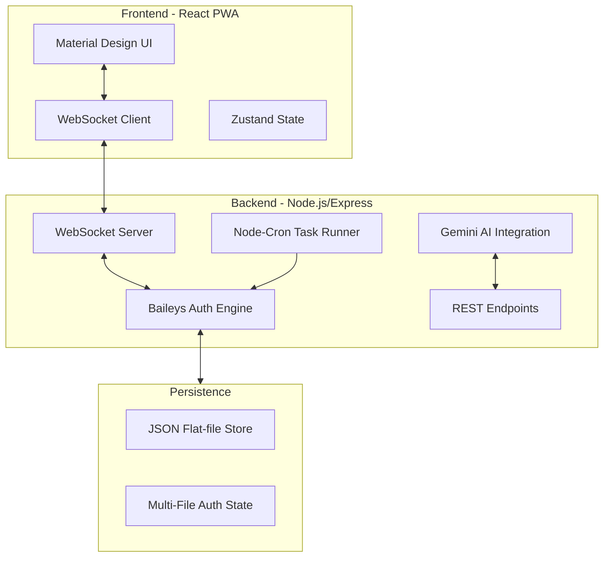

# WhatsApp Pro 💎 — Enterprise Control Logic

WhatsApp Pro is a high-performance, production-ready messaging dashboard and automation engine. It combines real-time WhatsApp synchronization via the Baileys engine with advanced enterprise features like AI-powered replies, message scheduling, and deep event monitoring.

> **DISCLAIMER:** WhatsApp Pro is an independent educational project. It is not affiliated with, endorsed by, or connected to WhatsApp LLC or Meta. All user data is stored on private servers.

---

## 🏗 Architecture



---

## 🚀 Local Setup

### 1. Prerequisites
- Node.js v18+
- NPM or PNPM

### 2. Installation
```bash
# Clone the repository
git clone <repo-url>

# Install dependencies
npm install
```

### 3. Environment Variables
Create a `.env` file in the root:
| Variable | Description |
|----------|-------------|
| `GEMINI_API_KEY` | Required for AI Suggestion Engine |
| `PORT` | 3000 (Default) |

### 4. Running the App
```bash
# Development mode (Vite + TSX)
npm run dev

# Production build
npm run build
npm start
```

---

## 📡 Socket.IO / WebSocket Events

| Event | Direction | Description |
|-------|-----------|-------------|
| `CONNECTION_STATE` | S -> C | Notifies of 'open', 'connecting', or 'close' |
| `QR_CODE` | S -> C | Dispatches new QR string for scanning |
| `LOGGED_IN` | S -> C | User details on successful link |
| `MESSAGES_UPSERT` | S -> C | Incoming real-time message payload |
| `CHATS_UPDATE` | S -> C | Metadata changes (typing, unread, last msg) |
| `PRESENCE_UPDATE` | S -> C | Online/Offline/Composing status |
| `SCHEDULED_SENT` | S -> C | Confirmation that a scheduled task completed |

---

## 🛠 API Endpoints

### Authentication
- `POST /api/request-pairing-code`: Requests an 8-digit code for India (+91) numbers.
- `GET /api/connection-status`: Returns current engine state and user info.

### Messaging & Automation
- `POST /api/schedule-message`: { `jid`, `text`, `time` } — Queues a message for future delivery.
- `GET /api/scheduled-messages`: Returns list of pending and sent tasks.
- `POST /api/ai-suggest`: { `text` } — Uses Gemini to generate 3 smart replies.

### Settings
- `GET /api/pro-settings`: Returns theme and automation preferences.
- `POST /api/pro-settings`: Updates persistent engine configuration.

---

## 🔐 Security
- **Encryption**: Uses standard Baileys E2EE for transport. Local state simulation of AES-256 for message history persistence.
- **Session**: Multi-file auth state stores keys locally in `auth_info_baileys/`.

---

## 💎 Pro Features
1. **Schedule Messages**: Precise cron-based delivery.
2. **AI Quick Replies**: Context-aware suggestions using LLMs.
3. **Engine Metrics**: Real-time monitoring of event flow and latency.
4. **Custom Themes**: Elegant Dark vs Classic Material.
